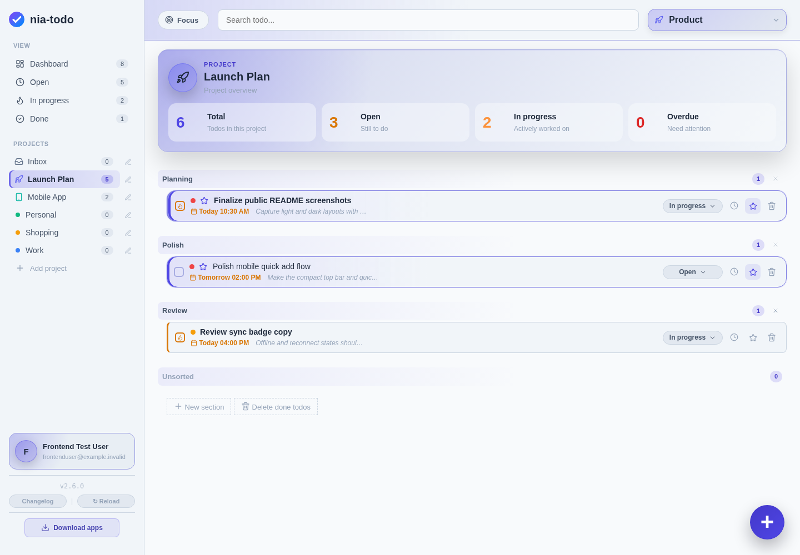
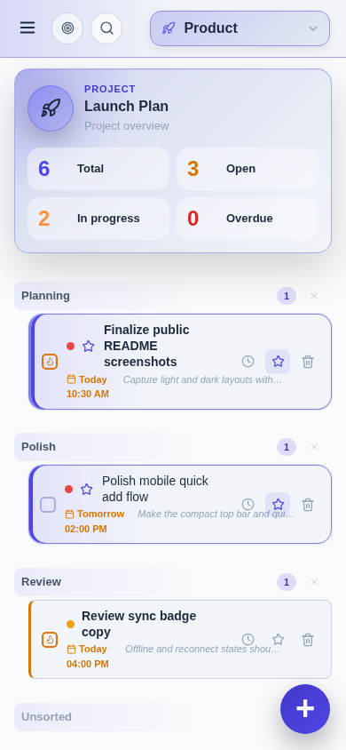

#  nia-todo

自托管待办系统 — SQLite + FastAPI + Web 界面 + 离线 PWA + 原生 Windows/Android 客户端。

nia-todo 专为私有自托管设计：安装服务器，打开 Web 应用，然后直接从你自己的实例下载捆绑的原生应用。

[English](README.md)

## 📸 截图

<p align="center">
  
  
</p>
<p align="center"><em>桌面端 Web 应用 — 亮色与暗色主题</em></p>

<p align="center">
  
  &nbsp;&nbsp;
  
</p>
<p align="center"><em>移动端/PWA 布局 — 亮色与暗色主题</em></p>

## ✨ 功能特性

- 📝 待办事项：描述、优先级、截止日期、状态、提醒和循环计划
- 🔁 循环待办：支持每日、每周、每月或每年间隔；完成当前事项后自动创建下一次
- 📁 项目/分类：子项目、分区、工作区和受保护的用户专属收件箱
- 🤝 项目共享：用户间共享项目，支持邀请和撤销
- 📧 邮件/SMTP 集成：邀请、密码重置和邮箱验证
- 📱 离线 PWA：本地 IndexedDB 同步队列
- 🖥️ 原生 Windows 桌面应用
- 🤖 原生 Android APK
- 🔐 认证、管理面板、API 密钥、CSRF 保护和用户数据隔离
- 🛡️ 双重验证/多因素认证：TOTP、通行密钥/WebAuthn、邮箱验证码、恢复码、受信设备和管理员策略
- 🔔 Windows 和 Android 原生本地提醒；浏览器/PWA 推送仅限浏览器/PWA
- 🎙️ BrainDump 语音捕获：将语音笔记转为待审阅的待办候选项，支持可配置的 STT/LLM 提供商
- 🎨 主题切换和中文/英文/德文界面语言支持
- 🗄️ 本地 SQLite 数据库

## 🔁 循环待办

待办事项可以配置为按每日、每周、每月或每年重复，并支持自定义间隔。循环待办需要设置截止日期；当当前事项被完成后，nia-todo 会保持其完成状态并自动创建下一个待办事项。现有提醒会尽可能按照相同的循环节奏顺延。

## 🎙️ BrainDump

BrainDump 是一个可选的语音捕获工作流，用于将自然语言笔记转为待审阅的待办候选项。默认禁用，需要管理员启用。

支持的提供商类型包括：

- 兼容 whisper.cpp 风格转录 API 的远程或本地 STT 端点
- 兼容 OpenAI 的 LLM 端点，如 LM Studio
- Ollama API 端点，包括本地 Ollama 和 Ollama Cloud
- OpenClaw 的 OpenAI 兼容网关，使用如 `openclaw/braindump` 的代理模型

管理员在 `/admin` 中配置 BrainDump、测试提供商连接、启用全局功能，然后按用户授权访问。原生 Windows/Android 应用和桌面端 Web 应用在平台授予麦克风权限后均可使用语音工作流。

## 📦 发布产物

公开发布提供以下主要分发目标：

- **完整服务器包**：`nia-todo-server-vX.Y.Z-full.deb`
  - 安装/更新服务器
  - 包含 Web/PWA 前端
  - 包含 `/downloads/` 下的原生应用下载
- **Docker 镜像**：用于容器化部署

Windows 和 Android 客户端打包在服务器包中，你的实例可以从 `/downloads/` 本地提供下载。

## 🚀 Debian/Ubuntu 安装

从发布页面下载完整服务器包，然后安装：

```bash
sudo apt install ./nia-todo-server-vX.Y.Z-full.deb
```

安装包会自动启用并启动服务器。检查状态：

```bash
sudo systemctl status nia-todo
sudo journalctl -u nia-todo -f
```

然后在浏览器中打开设置页面创建初始管理员账户：

```text
http://YOUR-SERVER:8753/setup
```

设置完成后，打开应用：

```text
http://YOUR-SERVER:8753/
```

管理面板位于：

```text
http://YOUR-SERVER:8753/admin
```

原生应用下载由你的实例提供：

```text
http://YOUR-SERVER:8753/downloads/
```

生产环境中，请将 nia-todo 放在 HTTPS/反向代理后面，并在管理面板中设置公共基础 URL。通行密钥和原生应用集成依赖正确的公共 URL。

## 🔄 更新

当有新的 GitHub 发布版本时，Debian/systemd 安装可以从管理面板直接更新。
服务器下载 `.deb` 包，验证发布的 SHA256 校验和，创建升级前 SQLite 备份，通过受限的 root 助手安装包，并重启服务。

手动更新同样可用：

```bash
sudo apt install ./nia-todo-server-vX.Y.Z-full.deb
```

安装包会保留现有运行时数据，并在数据库存在时创建升级前 SQLite 备份。
默认还会安装每日 systemd 备份定时器。

大版本升级前的建议操作：

```bash
sudo systemctl stop nia-todo
sudo cp -a /var/lib/nia-todo /var/lib/nia-todo.backup.$(date +%Y%m%d-%H%M%S)
sudo apt install ./nia-todo-server-vX.Y.Z-full.deb
```

## 🐳 Docker

Docker 安装不支持从 nia-todo 容器内部自更新。管理面板可以显示有新版本可用，但你需要通过拉取最新镜像并重新创建容器/堆栈来更新 Docker：

```bash
docker compose pull && docker compose up -d
```

直接运行已发布的镜像：

```bash
docker run -d \
  --name nia-todo \
  --restart unless-stopped \
  -p 8753:8753 \
  -e NIA_TODO_HOST=auto \
  -e NIA_TODO_PORT=8753 \
  -e NIA_TODO_DATA_DIR=/data \
  -e NIA_TODO_DB=nia-todo.db \
  -v nia-todo-data:/data \
  ghcr.io/weedpump/nia-todo:latest
```

或者创建本地 `compose.yml`，无需克隆源码仓库：

```yaml
services:
  nia-todo:
    image: ghcr.io/weedpump/nia-todo:latest
    ports:
      - "8753:8753"
    environment:
      NIA_TODO_HOST: auto
      NIA_TODO_PORT: 8753
      NIA_TODO_DATA_DIR: /data
      NIA_TODO_DB: nia-todo.db
    volumes:
      - nia-todo-data:/data

volumes:
  nia-todo-data:
```

然后启动：

```bash
docker compose up -d
```

默认容器数据卷：

```text
/data
```

## 🧱 默认包布局

- 应用：`/opt/nia-todo`
- 数据：`/var/lib/nia-todo`
- 配置：`/etc/nia-todo/nia-todo.env`
- 服务：`nia-todo.service`

常用命令：

```bash
sudo systemctl status nia-todo
sudo systemctl status nia-todo-backup.timer
sudo systemctl start nia-todo-backup.service
sudo systemctl restart nia-todo
sudo journalctl -u nia-todo -f
```

## ⚙️ 设置 / 运维

- 初始设置：`/setup`
- 管理面板：`/admin`
- 原生应用下载：`/downloads/`
- 运行时数据：`/var/lib/nia-todo`
- 配置文件：`/etc/nia-todo/nia-todo.env`

生产环境中，请在管理面板中配置正确的 HTTPS `public_base_url`。通行密钥和原生应用集成依赖此设置。Android 通行密钥通过 `/.well-known/assetlinks.json` 使用捆绑的应用签名。

## 🔑 重置管理员密码

如果忘记管理员密码，可以直接在服务器上重置。工具会自动读取配置的数据库位置。

Debian/systemd 安装：

```bash
sudo nia-todo-admin-password-reset
sudo systemctl restart nia-todo
```

Docker Compose 安装：

```bash
docker compose exec nia-todo nia-todo-admin-password-reset
```

普通 Docker 安装：

```bash
docker exec -it nia-todo nia-todo-admin-password-reset
```

密码必须符合管理员密码规则。重置后现有管理员会话将失效。

## 📚 文档

- [API 文档](docs/api.md)
- [更新日志](CHANGELOG.md)

## 🧪 开发 / 源码构建

公共仓库是发布的干净源码快照。常规自托管请使用发布包或 Docker 镜像。

基本的本地源码运行：

```bash
python3 -m venv .venv
. .venv/bin/activate
pip install -r requirements.txt
./start.sh
```

前端/原生开发使用 `package.json` 和 `src-tauri/` 中声明的 Node/Tauri 工具链。

## 🗄️ 备份

Debian 安装包默认安装每日自动备份定时器：

```bash
sudo systemctl status nia-todo-backup.timer
sudo systemctl start nia-todo-backup.service
```

手动备份：

```bash
sudo nia-todo-backup
```

手动恢复：

```bash
sudo systemctl stop nia-todo
sudo nia-todo-restore /var/lib/nia-todo/backups/nia-todo-YYYYMMDD-HHMMSS.zip
sudo systemctl start nia-todo
```

迁移现有安装的最简方法：

1. 在旧安装上创建备份。
2. 安装新包或启动新 Docker 部署。
3. 将备份恢复到新数据目录。

运行时数据位于 `/var/lib/nia-todo`，包含 SQLite 数据库、生成的密钥、头像和本地运行时数据。

## 📄 许可证

Copyright (C) 2026 Tobias Kneidl

nia-todo 是基于 GNU Affero 通用公共许可证 v3.0 或更高版本 (AGPL-3.0-or-later) 授权的自由软件。
详见 [`LICENSE`](LICENSE) 和 [`NOTICE`](NOTICE)。
